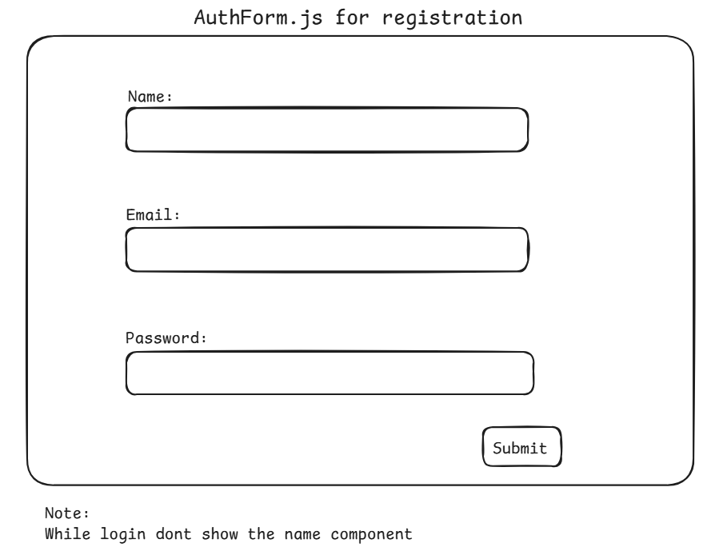

# Dev Portfolio Builder - Backend

---

## Overview

Dev Portfolio Builder is a web application that allows developers to create and manage their portfolio dynamically. Users can input their personal details, projects, skills, and experience, which will be displayed in a structured portfolio format. The application also integrates AI-based features to generate personalized portfolio suggestions and auto-fill descriptions using OpenAI's API.

---


## Features

- **User Authentication** (Signup/Login)
- **AI-powered Profile Suggestions** and Auto-generated Content
- **Dynamic Profile Creation**
- **Project Showcase** with Images and Descriptions
- **Skills and Experience Section**
- **Custom Themes** for Portfolio Styling
- **Live Preview and Deployment Options**

---

## Tech Stack

- **Frontend:** React.js, Tailwind CSS
- **Backend:** Node.js, Express.js
- **Database:** MongoDB
- **Authentication:** JWT (JSON Web Token)
- **Storage:** Cloudinary (for Images)
- **AI Integration:** OpenAI API (GPT-4 for Auto-suggestions)
- **Deployment:** AWS EC2 (Backend), S3 (Frontend), MongoDB Atlas

---

## Folder Structure

```
/portfolio-builder
|-- /client  (React Frontend)
|   |-- /src
|       |-- /components
|       |-- /pages
|       |-- App.js
|-- /server  (Node.js Backend)
|   |-- /models
|   |-- /routes
|   |-- server.js
```

---

# Step-by-Step Guide to Building the Backend

## Step 1: Initialize a Node.js Project

1. Open a terminal and create a new folder for the backend:
   ```sh
   mkdir server && cd server
   ```
2. Initialize a Node.js project:
   ```sh
   npm init -y
   ```
3. Install required dependencies:
   ```sh
   npm install express mongoose dotenv cors jsonwebtoken bcryptjs
   ```

📖 **Learn More:**
- [Node.js Official Docs](https://nodejs.org/en/docs/)
- [NPM Package Management](https://docs.npmjs.com/)

---

## Step 2: Setup the Database Connection

1. Create a `.env` file and add MongoDB connection details.
2. Create a new file `server.js` and set up an Express server.
3. Use Mongoose to connect to MongoDB using credentials from `.env`.
4. Ensure that the connection is successful by logging messages to the console.

📖 **Learn More:**
- [MongoDB Documentation](https://www.mongodb.com/docs/)
- [Mongoose Guide](https://mongoosejs.com/docs/guide.html)

---

## Step 3: Create the User Model

1. Inside the `server` folder, create a new folder called `models`.
2. Inside `models`, create a file named `User.js`.
3. Define the user schema with fields such as `name`, `email`, `password`, `bio`, `skills`, and `projects`.
4. Export the Mongoose model for further use in authentication and user management.

📖 **Learn More:**
- [Mongoose Schema & Models](https://mongoosejs.com/docs/models.html)
- [Understanding MongoDB Schemas](https://www.mongodb.com/docs/manual/core/schema-validation/)

---

## Step 4: Create Authentication Routes

1. Inside the `server` folder, create a new folder called `routes`.
2. Inside `routes`, create a file named `auth.js`.
3. Define routes for user registration (`/register`) and login (`/login`).
4. Use bcrypt to hash passwords before storing them in the database.
5. Generate JWT tokens for authentication upon successful login.
6. Validate user credentials before allowing login access.

📖 **Learn More:**
- [Express.js Routing](https://expressjs.com/en/guide/routing.html)
- [Bcrypt for Password Hashing](https://www.npmjs.com/package/bcryptjs)
- [JWT Authentication](https://jwt.io/introduction/)

---

## Step 5: Connect Routes to Server

1. Open `server.js` and import authentication routes.
2. Use Express middleware to enable JSON request handling and CORS.
3. Register authentication routes using `app.use("/api/auth", authRoutes);`.
4. Restart the server and test the API endpoints using tools like Postman or cURL.
5. Verify user registration and login flow to ensure authentication works correctly.

📖 **Learn More:**
- [Express Middleware](https://expressjs.com/en/guide/using-middleware.html)
- [Postman API Testing](https://learning.postman.com/docs/getting-started/introduction/)

---

## Step 6: Implement Portfolio Management (CRUD Operations in Detail)

### Create Portfolio Model

1. Inside `models`, create `Portfolio.js`.
2. Define a schema with fields: `userId`, `title`, `description`, `projects`, `skills`, `theme`.
3. Export the model for use in controllers.

### Create Portfolio Controller

1. Inside `controllers`, create `portfolioController.js`.
2. Define CRUD functions:
   - `createPortfolio`: Accepts user input and saves it in the database.
   - `getPortfolio`: Retrieves portfolio details based on `userId`.
   - `updatePortfolio`: Modifies existing portfolio details.
   - `deletePortfolio`: Removes portfolio data from the database.

### Define Portfolio Routes

1. Inside `routes`, create `portfolio.js`.
2. Implement Express routes:
   ```js
   router.post("/", createPortfolio);
   router.get("/:userId", getPortfolio);
   router.put("/:id", updatePortfolio);
   router.delete("/:id", deletePortfolio);
   ```
3. Import routes in `server.js` and use `app.use("/api/portfolio", portfolioRoutes);`.

📖 **Learn More:**
- [REST API Best Practices](https://www.restapitutorial.com/)
- [MongoDB CRUD Guide](https://www.mongodb.com/docs/manual/crud/)

---

## Step 7: AI-Powered Portfolio Suggestions

### Install OpenAI SDK

```sh
npm install openai
```

### Configure OpenAI API

1. Inside the `server` folder, create a `.env` file and add:
   ```env
   OPENAI_API_KEY=your_openai_api_key
   ```
2. Inside `server/controllers`, create a file named `aiController.js`.

### Define AI Controller

```js
const OpenAI = require("openai");
const dotenv = require("dotenv");
dotenv.config();

const openai = new OpenAI({ apiKey: process.env.OPENAI_API_KEY });

const generatePortfolioSuggestions = async (req, res) => {
    try {
        const { skills, experience, projects } = req.body;
        const prompt = `Create a developer portfolio description based on these skills: ${skills.join(", ")}, experience: ${experience}, and projects: ${projects.join(", ")}.`;
        const response = await openai.completions.create({
            model: "gpt-4",
            prompt: prompt,
            max_tokens: 200
        });
        res.json({ suggestion: response.choices[0].text.trim() });
    } catch (error) {
        console.error("OpenAI Error:", error);
        res.status(500).json({ error: "Failed to generate AI suggestions" });
    }
};

module.exports = { generatePortfolioSuggestions };
```

📖 **Learn More:**
- [OpenAI API Docs](https://platform.openai.com/docs/)
- [GPT-4 API Guide](https://openai.com/research/gpt-4)


### Dev Portfolio Builder - Frontend Documentation


## Overview

The frontend of the Dev Portfolio Builder is built using React.js with Tailwind CSS for styling. The goal is to create a dynamic, user-friendly interface where users can:

- Enter their details to generate a portfolio
- Upload images and projects
- Use AI-powered auto-fill for content
- Customize portfolio themes
- Preview the portfolio in real-time

## Tech Stack

- **React.js** (Frontend framework)
- **Tailwind CSS** (Styling)
- **Axios** (API requests)
- **React Router** (Navigation)

# Frontend Development Guide for Dev Portfolio Builder

## Step-by-Step Guide to Building the Frontend

### Step 1: Initialize a React Project

1.  **Create a new React project**:

    - Open a terminal and navigate to the project directory.
    - Run the following command to create a new React project named `client`:

      ```sh
      npx create-react-app client
      ```

    - Navigate into the newly created project directory:

      ```sh
      cd client
      ```

2.  **Install Tailwind CSS**:

    - Install the necessary dependencies for Tailwind CSS:

      ```sh
      npm install -D tailwindcss postcss autoprefixer
      ```

    - Initialize Tailwind CSS configuration:

      ```sh
      npx tailwindcss init
      ```

3.  **Configure Tailwind CSS**:

    - Update the `tailwind.config.js` file to include the content paths:

      Java

      ```js
      module.exports = {
        content: [
          "./src/**/*.{js,jsx,ts,tsx}",
        ],
        theme: {
          extend: {},
        },
        plugins: [],
      }
      ```

    - Update the `src/index.css` file to include Tailwind directives:


      ```css
      @tailwind base;
      @tailwind components;
      @tailwind utilities;
      ```

4.  **Install Axios for API calls**:

    - Install Axios to make HTTP requests to the backend API:

      ```sh
      npm install axios
      ```

### Step 2: Create the Main Components

1.  **Create a `components` folder**:

    - Inside the `src` directory, create a new folder named `components`:

      ```sh
      src/components
      ```

2.  **Create the main components**:

    - Inside the `components` folder, create the following files:

      ```sh
       src/components/Navbar.js
       src/components/Footer.js
       src/components/AuthForm.js
       src/components/PortfolioForm.js
       src/components/PortfolioPreview.js
       src/components/AISuggestions.js
      ```

### Step 3: Implement Authentication Components

1.  **Create the `AuthForm` component**:

    - Open `src/components/AuthForm.js` and set up the basic structure for the authentication form.
    - 1.  - Set up the basic structure for the authentication form.
    - This component will handle both registration and login based on the `mode` prop.
    - Define state to manage form data.
    - Create a form with input fields for the following:

      - **Name**: For registration.
      - **Email**: Required for both registration and login.
      - **Password**: Required for both registration and login.

    - Add a submit handler to send form data to the backend API using Axios.
    - Apply Tailwind CSS classes for styling.

    

2.  **Create the `Navbar` component**:

    - Open `src/components/Navbar.js` and set up the basic structure for the navigation bar.
    - Include links to different pages (e.g., Home, Login / Register).

3.  **Create the `Footer` component**:

    - Open `src/components/Footer.js` and set up the basic structure for the footer.

    

### Step 4: Set Up Routing

1.  **Install React Router**:

    - Install `react-router-dom` to handle routing in the application:

      ```sh
      npm install react-router-dom
      ```

2.  **Set up routes in `App.js`**:

    - Open `src/App.js` and set up the routes for different pages:


      ```jsx
      import { BrowserRouter as Router, Route, Switch } from 'react-router-dom';
      import Navbar from './components/Navbar';
      import Footer from './components/Footer';
      import AuthForm from './components/AuthForm';
      import PortfolioForm from './components/PortfolioForm';
      import PortfolioPreview from './components/PortfolioPreview';
      import AISuggestions from './components/AISuggestions';

      function App() {
        return (
          <Router>
            <Navbar />
            <Switch>
              <Route path="/login">
                <AuthForm mode="login" />
              </Route>
              <Route path="/register">
                <AuthForm mode="register" />
              </Route>
              <Route path="/portfolio/create">
                <PortfolioForm />
              </Route>
              <Route path="/portfolio/preview">
                <PortfolioPreview />
              </Route>
              <Route path="/ai/suggestions">
                <AISuggestions />
              </Route>
            </Switch>
            <Footer />
          </Router>
        );
      }

      export default App;
      ```

### Step 5: Implement the `AuthForm` Component

1.  **Set up state and form handling**:

    - In `src/components/AuthForm.js`, set up state to manage form data and handle form submission.

2.  **Connect to the backend API**:

    - Use Axios to send form data to the backend API for registration and login.

### Step 6: Implement the `PortfolioForm` Component

### Detailed Steps for `PortfolioForm` Component

1.  **Set up state and form handling**:

    - Define initial state for `title`, `description`, `projects`, `skills`, and `theme`.
    - Create a `handleChange` function to update the state when the user interacts with the form fields.
    - Create a `handleSubmit` function to handle form submission and send data to the backend API.

2.  **Create form fields**:

    - Add a text input field for the portfolio title.
    - Add a textarea for the portfolio description.
    - Add a textarea for listing the user's projects.
    - Add a text input field for the user's skills.
    - Add a dropdown select field for choosing the portfolio theme.

3.  **Apply Tailwind CSS classes**:

    - Use Tailwind CSS classes to style each form field and the submit button.
    - Ensure the form is centered and has appropriate padding and margins.

4.  **Connect to the backend API**:

    - Use Axios to send a POST request to the backend API endpoint (`/api/portfolio`) when the form is submitted.
    - Handle the response from the backend API and provide feedback to the user (e.g., display a success message or an error message).

5. **Give a AI suggestions button**:

    - the AISuggestions component will be here

### Step 7: Implement the `PortfolioPreview` Component

#### 1. Fetch Portfolio Data

1.  **Navigate to the `components` folder**:

    - Ensure you are in the `client` directory.
    - Go to the `components` folder:

      ```sh
      cd src/components
      ```

2.  **Create the `PortfolioPreview.js` file**:

    - Create a new file named `PortfolioPreview.js`:

      ```sh
       PortfolioPreview.js
      ```

3.  **Set up the `PortfolioPreview` component**:

    - Open `PortfolioPreview.js`.
    - Import necessary dependencies (`React`, `useState`, `useEffect`, `axios`).
    - Define state to store the fetched portfolio data.
    - Use the `useEffect` hook to fetch the portfolio data from the backend API when the component mounts.
    - Handle the response from the backend API and update the state with the fetched data.

#### 2. Display Portfolio Data

1.  **Render the portfolio details in a structured format**:

    - Use the state to access the portfolio data.
    - Create a structured layout to display the portfolio details, including:

      - **Title**: Display the portfolio title.
      - **Description**: Display the portfolio description.
      - **Projects**: List the user's projects.
      - **Skills**: List the user's skills.
      - **Theme**: Display the selected theme.

    - Apply Tailwind CSS classes for styling to ensure the layout is visually appealing and responsive.

### Detailed Steps for `PortfolioPreview` Component

1.  **Set up state and fetch data**:

    - Define initial state for the portfolio data.
    - Use the `useEffect` hook to fetch the portfolio data from the backend API when the component mounts.
    - Handle the response from the backend API and update the state with the fetched data.
    - Handle any errors that may occur during the fetch operation.

2.  **Create a structured layout to display the portfolio details**:

    - Use a combination of HTML elements (e.g., `div`, `h2`, `p`, `ul`) to create a structured layout.
    - Display the portfolio title, description, projects, skills, and theme in a clear and organized manner.
    - Apply Tailwind CSS classes to style each element and ensure the layout is responsive and visually appealing.

3.  **Handle loading and error states**:

    - Display a loading indicator while the data is being fetched.
    - Display an error message if the fetch operation fails.
    - Display a success message or the portfolio details once the data is successfully fetched.

### Step 8: Implement the `AISuggestions` Component

#### 1. Fetch AI Suggestions

1.  **Navigate to the `components` folder**:

    - Ensure you are in the `client` directory.
    - Go to the `components` folder:

      ```sh
      cd src/components
      ```

2.  **Create the `AISuggestions.js` file**:

    - Create a new file named `AISuggestions.js`:

      ```sh
       AISuggestions.js
      ```

3.  **Set up the `AISuggestions` component**:

    - Open `AISuggestions.js`.
    - Import necessary dependencies (`React`, `useState`, `useEffect`, `axios`).
    - Define state to store the fetched AI suggestions.
    - Use the `useEffect` hook to fetch the AI suggestions from the backend API when the component mounts.
    - Handle the response from the backend API and update the state with the fetched suggestions.
    - Handle any errors that may occur during the fetch operation.
    - Example api call

    ```jsx
    useEffect(() => {
      const fetchAISuggestions = async () => {
        try {
          const response = await axios.post('/api/ai/suggest', {
            skills: 'JavaScript, React, Node.js',
            experience: '2 years of web development',
            projects: 'E-commerce website, Portfolio Builder'
          });
          setSuggestions(response.data.suggestion);
          setLoading(false);
        } catch (err) {
          setError(err);
          setLoading(false);
        }
      };

      fetchAISuggestions();
    }, []);
    ```

#### 2. Display Suggestions

1.  **Render the AI-generated suggestions**:

    - Use the state to access the AI suggestions.
    - Create a structured layout to display the suggestions in a clear and organized manner.
    - Apply Tailwind CSS classes for styling to ensure the layout is visually appealing and responsive.
    - Provide options for the user to review and accept the suggestions.

### Step 9: Style the Components with Tailwind CSS

1.  **Apply Tailwind CSS classes**:

    - Add Tailwind CSS classes to the components to style the UI.

### Step 10: Test the Application

1.  **Run the development server**:

    - Start the React development server:

      ```js
      npm start
      ```

2.  **Test the authentication flow**:

    - Navigate to the login and registration pages and test the authentication functionality.

3.  **Test portfolio creation and preview**:

    - Navigate to the portfolio creation page, fill in the details, and preview the portfolio.

4.  **Test AI suggestions**:

    - Navigate to the AI suggestions page and test the AI-generated portfolio suggestions.

### Conclusion

By following these steps, you will have set up the frontend for the Dev Portfolio Builder application. The frontend will allow users to authenticate, create and manage their portfolios, and receive AI-powered suggestions
